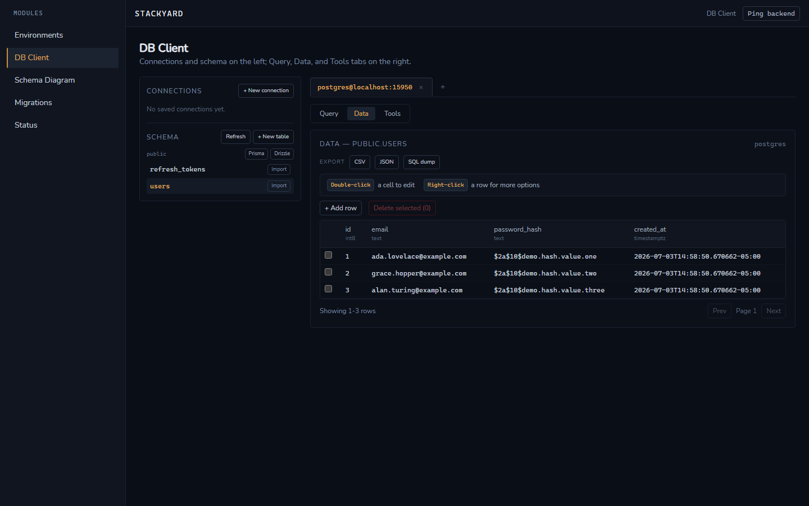
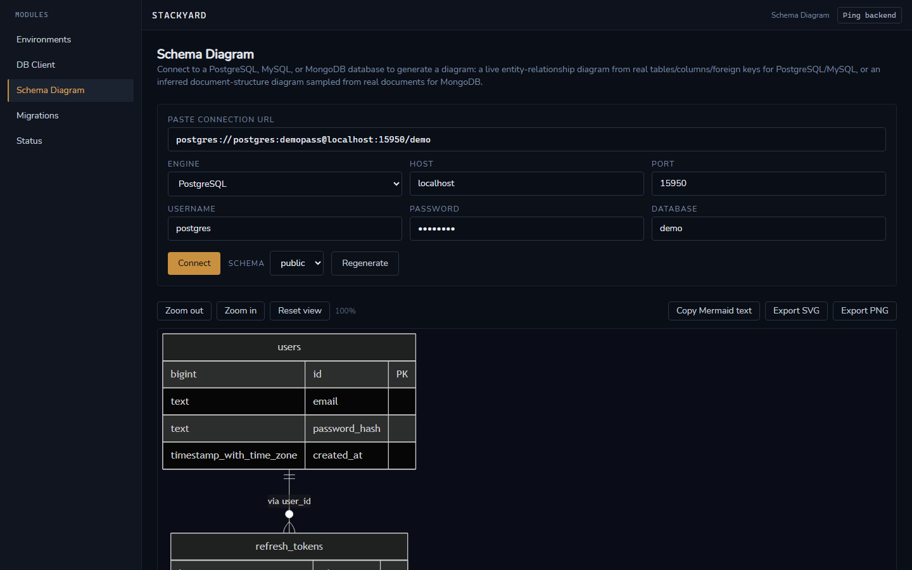

# Stackyard

**Local databases, without the friction.**

Stackyard is a native desktop app that owns the entire "spin up a local
database, then work with the data" loop: start Postgres, MySQL, MongoDB,
or Redis via Docker in a few clicks — no `docker-compose.yml` to write —
then browse, query, and edit that data from a built-in multi-engine DB
client, without opening a separate GUI tool.

It's a personal, open-source project (built with [Wails](https://wails.io):
Go + React/TypeScript), local-only — no cloud backend, no telemetry, no
account.





## Features

**Environment Manager**
- One-click PostgreSQL/MySQL/MongoDB/Redis environments via Docker, with
  no compose files ever written to disk.
- Auto-generated connection strings, copyable in one click.
- Per-service volume reset without touching sibling services.
- Real-time status dashboard (state, port, CPU, RAM) across all profiles.

**DB Client**
- Connect by pasting a connection string, or fill the form manually.
- Multi-tab sessions across multiple connections at once.
- A Monaco-based query editor with engine-aware syntax highlighting,
  autocomplete, and cancellable multi-statement execution.
- A spreadsheet-style editable data grid (PostgreSQL/MySQL/MongoDB) — edit
  cells in place, add rows, delete rows, with real `UPDATE`/`INSERT`/
  `DELETE` under the hood.
- Document tree viewer for MongoDB, key browser for Redis (string, hash,
  list, set, sorted set — with TTL view/edit).
- Saved snippets, per-connection query history, and a gallery of starter
  SQL templates.
- "Create table" UI that generates a real `CREATE TABLE`.

**Schema Diagram**
- Live entity-relationship diagrams from real schema introspection
  (PostgreSQL/MySQL), or inferred document structure for MongoDB.
- Zoom/pan, and export as PNG, SVG, or raw Mermaid text.

**Import / Export**
- CSV, JSON, and SQL dump export — full table or the current query's
  result set — plus `schema.prisma`/Drizzle `schema.ts` schema export.
- CSV/JSON import with pre-commit validation against the target table.

**Migrations**
- Create/apply/rollback schema migrations for PostgreSQL and MySQL, one
  step at a time, tracked in a `schema_migrations` table.

See the full [documentation site](docs-site/) for a deeper tour of every
module.

## Getting started

**Prerequisites:** Go 1.25+, Node.js + pnpm, the
[Wails CLI](https://wails.io/docs/gettingstarted/installation), and Docker
Desktop (or a local Docker Engine) running.

```sh
git clone https://github.com/KamerrEzz/stackyard.git
cd stackyard
wails dev
```

`wails build` produces a redistributable production binary. Full setup
and usage instructions live in the
[documentation site](docs-site/getting-started.md).

### Documentation site

The full docs (getting started, a page per feature, and project background)
are a [VitePress](https://vitepress.dev) site under `docs-site/`:

```sh
cd docs-site
pnpm install
pnpm run docs:dev     # local dev server
pnpm run docs:build   # static build to docs-site/.vitepress/dist
```

## License

Stackyard is released under the
[PolyForm Noncommercial License 1.0.0](LICENSE) — personal and
noncommercial use is permitted, attribution required. This is not a
commercial product. See [`LICENSE`](LICENSE) for the exact terms.
